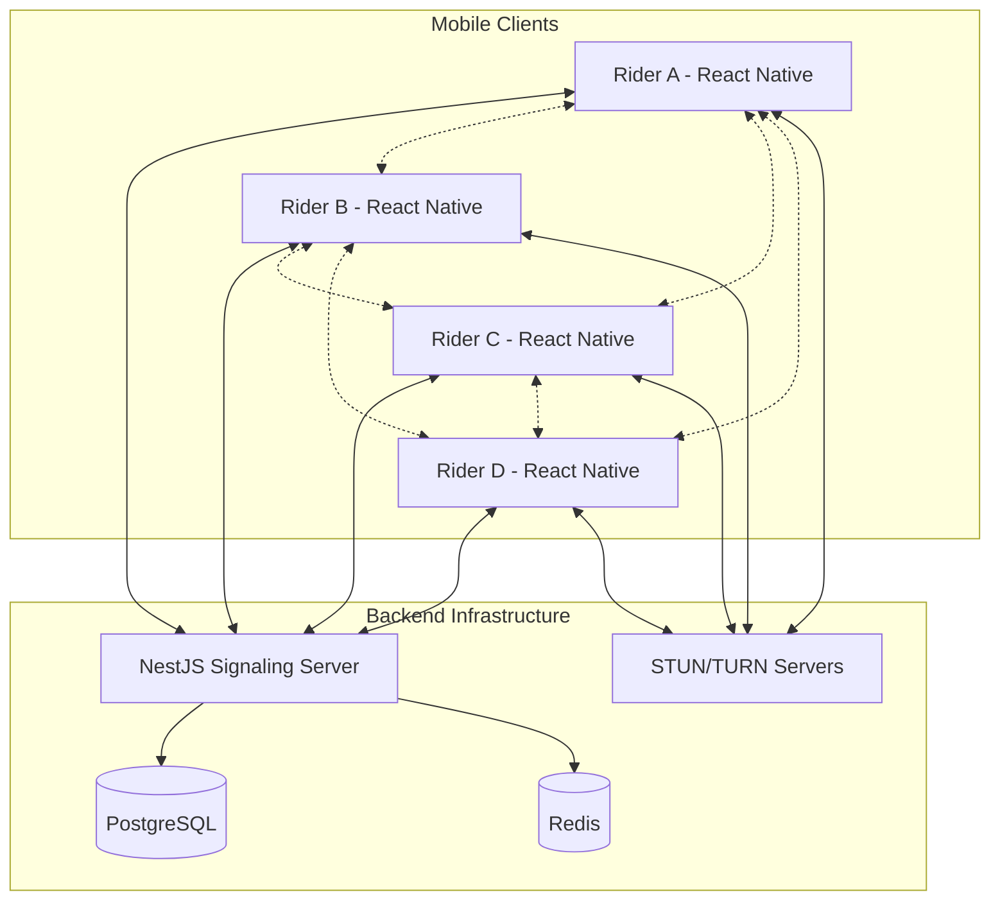

# Design Document

## Overview

The motorcycle rider communication app will be built using a hybrid architecture combining React Native for cross-platform mobile clients and NestJS for the signaling server. The system uses WebRTC for peer-to-peer audio communication with a mesh network topology for 4-8 riders, Socket.io for real-time signaling, and a PostgreSQL/Redis backend for data persistence and session management.

The architecture prioritizes low latency, automatic reconnection, and battery efficiency while maintaining high audio quality in challenging mobile network conditions.

## Architecture

### High-Level System Architecture



### WebRTC Topology Decision: Mesh Network

For 4-8 riders, a **mesh network topology** is optimal because:

- **Low Latency**: Direct peer-to-peer connections minimize delay
- **Reduced Server Load**: No media processing on the server
- **Cost Effective**: Eliminates need for expensive SFU infrastructure
- **Resilience**: Partial network failures don't affect all connections
- **Bandwidth Distribution**: Each client uploads once per peer (manageable for 4-8 users)

**Bandwidth Calculation**: For 8 riders at 32kbps audio:
- Upload per client: 7 × 32kbps = 224kbps
- Download per client: 7 × 32kbps = 224kbps
- Total system bandwidth: Distributed across peers

### Technology Stack Integration

- **Frontend**: React Native 0.72+ with TypeScript
- **Backend**: NestJS 10+ with TypeScript
- **Real-time Communication**: Socket.io for signaling, WebRTC for media
- **Database**: PostgreSQL 15+ for persistence, Redis 7+ for sessions
- **Audio Processing**: Native WebRTC audio processing with custom noise suppression

## Components and Interfaces

### React Native Frontend Components

#### Core Communication Components

```typescript
// Core WebRTC Manager
interface WebRTCManager {
  initializeConnection(roomId: string): Promise<void>
  joinRoom(roomId: string, userId: string): Promise<void>
  leaveRoom(): Promise<void>
  handleReconnection(): Promise<void>
  getConnectionStats(): ConnectionStats
}

// Audio Stream Manager
interface AudioStreamManager {
  startLocalStream(): Promise<MediaStream>
  stopLocalStream(): void
  addRemoteStream(peerId: string, stream: MediaStream): void
  removeRemoteStream(peerId: string): void
  applyNoiseSupression(stream: MediaStream): MediaStream
}

// Connection State Manager
interface ConnectionStateManager {
  connectionState: ConnectionState
  reconnectionAttempts: number
  updateConnectionState(state: ConnectionState): void
  handleConnectionFailure(): void
  scheduleReconnection(): void
}
```

#### UI Component Architecture

```
src/
├── components/
│   ├── communication/
│   │   ├── VoiceRoom.tsx
│   │   ├── ParticipantList.tsx
│   │   ├── ConnectionStatus.tsx
│   │   └── AudioControls.tsx
│   ├── common/
│   │   ├── Button.tsx
│   │   ├── LoadingSpinner.tsx
│   │   └── StatusIndicator.tsx
├── screens/
│   ├── HomeScreen.tsx
│   ├── JoinRoomScreen.tsx
│   ├── CreateRoomScreen.tsx
│   └── SettingsScreen.tsx
├── services/
│   ├── WebRTCService.ts
│   ├── SignalingService.ts
│   ├── AudioService.ts
│   └── ReconnectionService.ts
└── store/
    ├── slices/
    │   ├── communicationSlice.ts
    │   ├── userSlice.ts
    │   └── connectionSlice.ts
    └── store.ts
```

### NestJS Backend Architecture

#### Module Structure

```
src/
├── modules/
│   ├── auth/
│   │   ├── auth.controller.ts
│   │   ├── auth.service.ts
│   │   ├── auth.module.ts
│   │   └── dto/
│   ├── rooms/
│   │   ├── rooms.controller.ts
│   │   ├── rooms.service.ts
│   │   ├── rooms.module.ts
│   │   └── dto/
│   ├── signaling/
│   │   ├── signaling.gateway.ts
│   │   ├── signaling.service.ts
│   │   └── signaling.module.ts
│   └── users/
│       ├── users.controller.ts
│       ├── users.service.ts
│       └── users.module.ts
├── common/
│   ├── guards/
│   ├── interceptors/
│   └── decorators/
└── database/
    ├── entities/
    └── migrations/
```

#### WebSocket Gateway Interface

```typescript
@WebSocketGateway({
  cors: { origin: '*' },
  transports: ['websocket', 'polling']
})
export class SignalingGateway {
  @SubscribeMessage('join-room')
  handleJoinRoom(client: Socket, payload: JoinRoomDto): void

  @SubscribeMessage('leave-room')
  handleLeaveRoom(client: Socket): void

  @SubscribeMessage('webrtc-offer')
  handleWebRTCOffer(client: Socket, payload: WebRTCOfferDto): void

  @SubscribeMessage('webrtc-answer')
  handleWebRTCAnswer(client: Socket, payload: WebRTCAnswerDto): void

  @SubscribeMessage('ice-candidate')
  handleIceCandidate(client: Socket, payload: IceCandidateDto): void

  @SubscribeMessage('connection-state-change')
  handleConnectionStateChange(client: Socket, payload: ConnectionStateDto): void
}
```

## Data Models

### PostgreSQL Schema

```sql
-- Users table
CREATE TABLE users (
    id UUID PRIMARY KEY DEFAULT gen_random_uuid(),
    username VARCHAR(50) UNIQUE NOT NULL,
    email VARCHAR(255) UNIQUE NOT NULL,
    password_hash VARCHAR(255) NOT NULL,
    created_at TIMESTAMP DEFAULT CURRENT_TIMESTAMP,
    updated_at TIMESTAMP DEFAULT CURRENT_TIMESTAMP
);

-- Rooms table
CREATE TABLE rooms (
    id UUID PRIMARY KEY DEFAULT gen_random_uuid(),
    name VARCHAR(100) NOT NULL,
    room_code VARCHAR(10) UNIQUE NOT NULL,
    creator_id UUID REFERENCES users(id),
    max_participants INTEGER DEFAULT 8,
    is_active BOOLEAN DEFAULT true,
    created_at TIMESTAMP DEFAULT CURRENT_TIMESTAMP
);

-- Room participants
CREATE TABLE room_participants (
    id UUID PRIMARY KEY DEFAULT gen_random_uuid(),
    room_id UUID REFERENCES rooms(id),
    user_id UUID REFERENCES users(id),
    joined_at TIMESTAMP DEFAULT CURRENT_TIMESTAMP,
    left_at TIMESTAMP,
    is_active BOOLEAN DEFAULT true,
    UNIQUE(room_id, user_id)
);

-- Connection logs
CREATE TABLE connection_logs (
    id UUID PRIMARY KEY DEFAULT gen_random_uuid(),
    user_id UUID REFERENCES users(id),
    room_id UUID REFERENCES rooms(id),
    event_type VARCHAR(50) NOT NULL,
    connection_quality JSONB,
    timestamp TIMESTAMP DEFAULT CURRENT_TIMESTAMP
);
```

### Redis Data Structures

```typescript
// Active room sessions
interface RoomSession {
  roomId: string
  participants: Map<string, ParticipantInfo>
  createdAt: Date
  lastActivity: Date
}

// User presence
interface UserPresence {
  userId: string
  socketId: string
  roomId?: string
  connectionState: 'connected' | 'connecting' | 'disconnected'
  lastSeen: Date
}

// Connection state cache
interface ConnectionState {
  userId: string
  peerId: string
  state: RTCPeerConnectionState
  iceConnectionState: RTCIceConnectionState
  reconnectionAttempts: number
  lastReconnectAttempt: Date
}
```

## Error Handling

### Client-Side Error Handling

```typescript
class CommunicationErrorHandler {
  handleWebRTCError(error: RTCError): void {
    switch (error.name) {
      case 'NotAllowedError':
        // Handle microphone permission denied
        this.showPermissionDialog()
        break
      case 'NotFoundError':
        // Handle no microphone found
        this.showNoMicrophoneError()
        break
      case 'OverconstrainedError':
        // Handle audio constraints not supported
        this.fallbackToBasicAudio()
        break
      default:
        this.logError(error)
        this.showGenericError()
    }
  }

  handleSignalingError(error: SignalingError): void {
    if (error.code === 'CONNECTION_LOST') {
      this.initiateReconnection()
    } else if (error.code === 'ROOM_FULL') {
      this.showRoomFullError()
    }
  }

  handleNetworkError(error: NetworkError): void {
    this.connectionStateManager.handleConnectionFailure()
    this.scheduleReconnectionAttempt()
  }
}
```

### Server-Side Error Handling

```typescript
@Catch()
export class GlobalExceptionFilter implements ExceptionFilter {
  catch(exception: unknown, host: ArgumentsHost) {
    const ctx = host.switchToWs()
    const client = ctx.getClient<Socket>()

    if (exception instanceof WsException) {
      client.emit('error', {
        code: exception.getError(),
        message: exception.message,
        timestamp: new Date().toISOString()
      })
    } else {
      this.logger.error('Unexpected error:', exception)
      client.emit('error', {
        code: 'INTERNAL_ERROR',
        message: 'An unexpected error occurred',
        timestamp: new Date().toISOString()
      })
    }
  }
}
```

## Testing Strategy

### Unit Testing

- **React Native Components**: Jest + React Native Testing Library
- **WebRTC Services**: Mock WebRTC APIs with jest-webrtc-mock
- **NestJS Services**: Jest with dependency injection mocking
- **Database Operations**: In-memory PostgreSQL with testcontainers

### Integration Testing

- **WebRTC Signaling Flow**: End-to-end signaling message exchange
- **Room Management**: Complete room lifecycle testing
- **Reconnection Logic**: Network failure simulation and recovery
- **Audio Stream Management**: Mock audio stream handling

### Performance Testing

- **Memory Usage**: Monitor memory consumption during long sessions
- **CPU Usage**: Profile audio processing and WebRTC operations
- **Network Efficiency**: Measure bandwidth usage and optimization
- **Battery Impact**: Test power consumption on physical devices

### Testing Architecture

```typescript
// WebRTC Service Test Example
describe('WebRTCService', () => {
  let service: WebRTCService
  let mockPeerConnection: jest.Mocked<RTCPeerConnection>

  beforeEach(() => {
    mockPeerConnection = createMockPeerConnection()
    service = new WebRTCService(mockSignalingService, mockAudioService)
  })

  it('should establish peer connection', async () => {
    await service.createPeerConnection('peer-id')
    expect(mockPeerConnection.createOffer).toHaveBeenCalled()
  })

  it('should handle connection failure and reconnect', async () => {
    mockPeerConnection.connectionState = 'failed'
    await service.handleConnectionStateChange('peer-id')
    expect(service.reconnectionAttempts).toBe(1)
  })
})
```

### Device Testing Strategy

- **iOS Testing**: Physical devices (iPhone 12+) and simulators
- **Android Testing**: Physical devices (Android 10+) and emulators
- **Background Testing**: Verify background operation on both platforms
- **Network Conditions**: Test with varying network quality and interruptions
- **Battery Testing**: Long-duration testing with battery monitoring

This design provides a robust foundation for implementing the motorcycle rider communication app with all the specified requirements while maintaining scalability and performance.