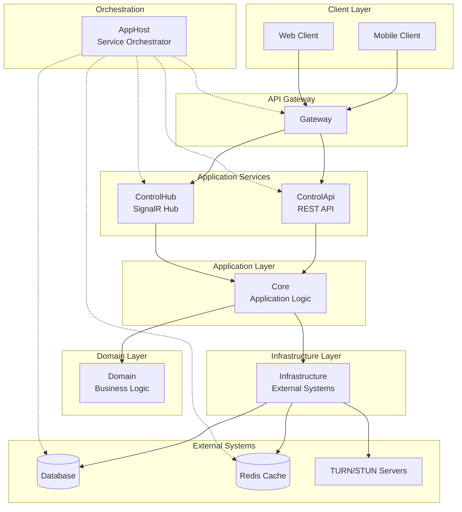
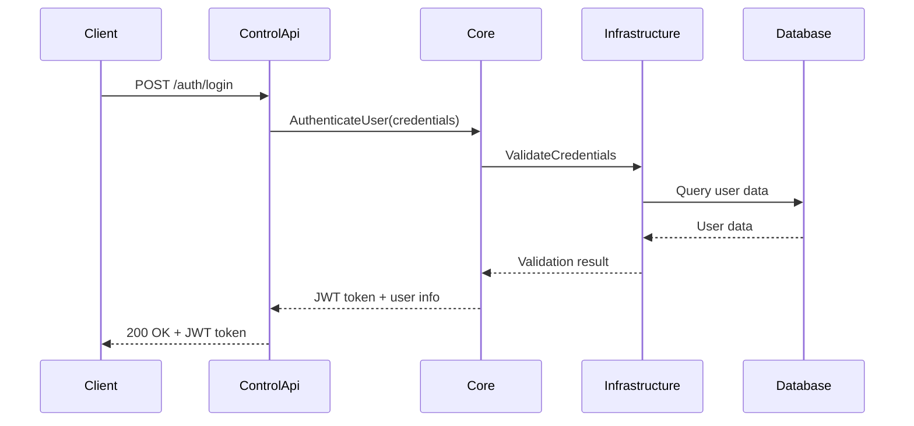
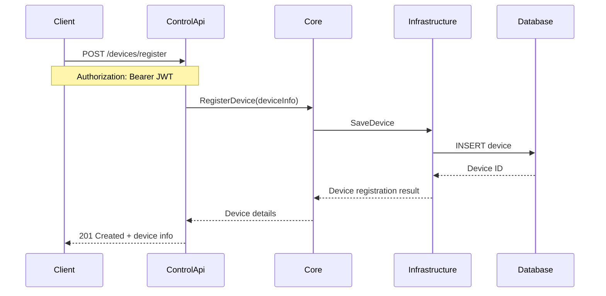
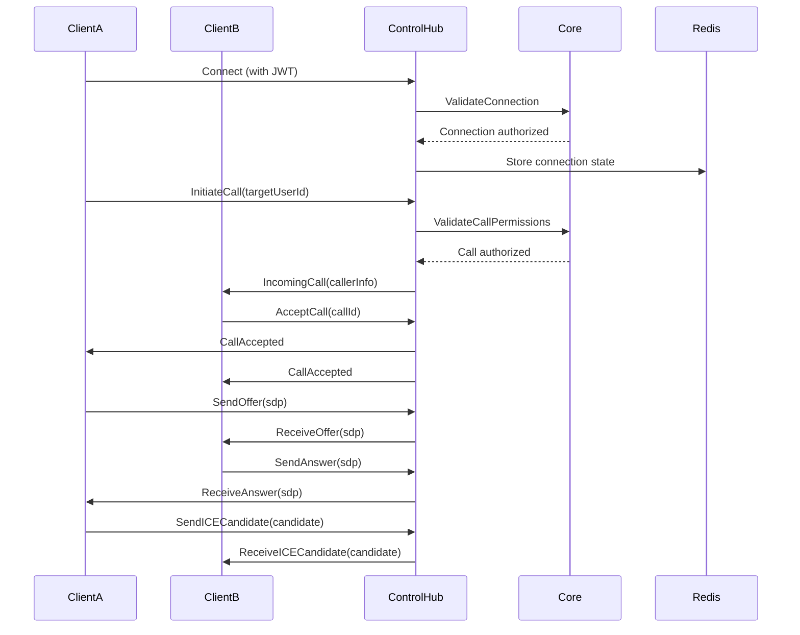
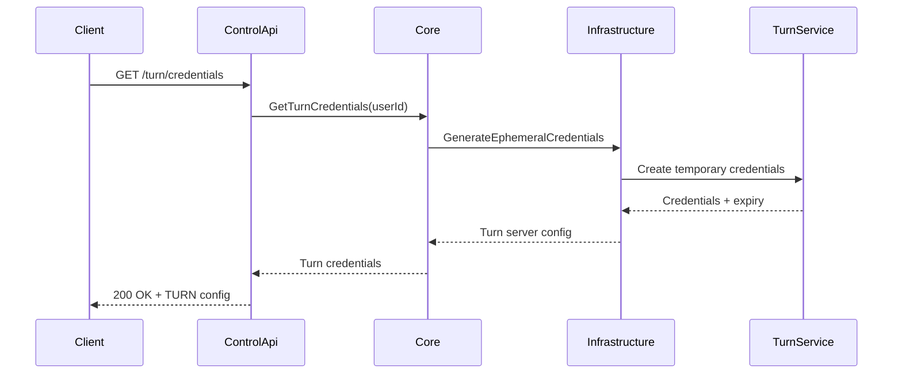
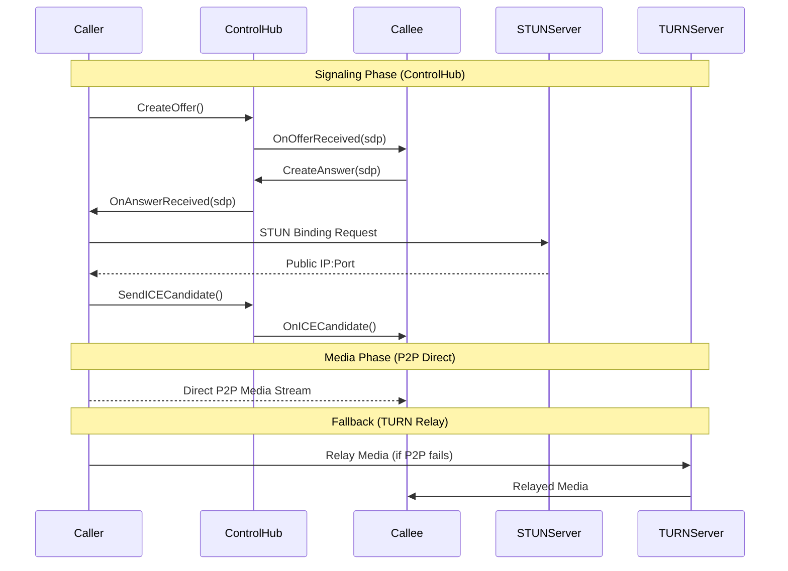

# RideCom Backend Service

A .NET Aspire-based backend solution for an intercom-style mobile application, providing real-time communication infrastructure with WebRTC signaling, authentication, and media coordination capabilities.

## Table of Contents

- [Project Overview](#project-overview)
- [Architecture](#architecture)
- [Project Structure](#project-structure)
- [Infrastructure Components](#infrastructure-components)
- [Communication Flow](#communication-flow)
- [Signaling vs Media Transport](#signaling-vs-media-transport)
- [Setup Instructions](#setup-instructions)
- [Security Considerations](#security-considerations)
- [Scaling and Observability](#scaling-and-observability)
- [Development Workflow](#development-workflow)
- [API Reference](#api-reference)

## Project Overview

RideCom Backend Service is a comprehensive communication platform built on .NET Aspire that enables real-time audio/video communication between mobile clients. The solution follows Clean Architecture principles with a layered approach, providing:

- **Real-time Communication**: WebRTC signaling coordination through SignalR
- **Authentication & Authorization**: JWT-based secure access control
- **Session Management**: Connection state tracking and lifecycle management
- **Media Coordination**: TURN/STUN server integration for NAT traversal
- **Scalable Infrastructure**: Redis-backed SignalR backplane for horizontal scaling

### Architecture Style

- **Clean Architecture**: Separation of concerns with Domain, Infrastructure, and Application layers
- **Microservices-Ready**: Aspire orchestration with independent service boundaries
- **Event-Driven**: Domain events for loose coupling between components
- **Cloud-Native**: Designed for containerization and cloud deployment

### Main Responsibilities

1. **Authentication**: Secure user login and device registration
2. **Signaling**: WebRTC SDP/ICE candidate exchange coordination
3. **Session Management**: Active connection tracking and state management
4. **Configuration**: TURN/STUN server credential distribution
5. **Monitoring**: Comprehensive telemetry and observability

## Architecture



## Project Structure

The solution is organized into distinct projects following Clean Architecture principles:

### Core Projects

#### 🚀 AppHost (Aspire AppHost)
- **Type**: .NET Aspire AppHost
- **Scope**: Service Orchestration
- **Responsibilities**:
  - Orchestrates all backend services and dependencies
  - Manages service discovery and configuration
  - Handles startup coordination and health checks
  - Provides development-time dashboard and monitoring
  - Configures service-to-service communication
  - Entry point for local development and cloud deployment

#### 🧠 Core (Class Library)
- **Type**: Application Logic Layer
- **Scope**: Business Workflow Orchestration
- **Responsibilities**:
  - Implements application use cases and workflows
  - Coordinates between Domain and Infrastructure layers
  - Handles authentication and authorization logic
  - Manages session negotiation and lifecycle
  - Orchestrates signaling coordination workflows
  - Implements business rules validation
  - Provides application services and DTOs

#### 🏛️ Domain (Class Library)
- **Type**: Domain Layer
- **Scope**: Pure Business Logic
- **Responsibilities**:
  - Contains domain entities and value objects
  - Defines business rules and domain events
  - Implements domain services and specifications
  - Provides domain interfaces and contracts
  - Framework-agnostic business logic
  - User, Device, Session, and Connection entities
  - Communication and signaling domain models

#### 🔧 Infrastructure (Class Library)
- **Type**: Infrastructure Layer
- **Scope**: External System Integration
- **Responsibilities**:
  - EF Core database access and repositories
  - Redis caching and session storage
  - External API integrations (TURN/STUN providers)
  - Message queuing and event handling
  - File storage and configuration management
  - Logging and telemetry implementations
  - Third-party service adapters

### Service Projects

#### 🌐 ControlApi (ASP.NET Core Web API)
- **Type**: REST API Service
- **Scope**: HTTP-based Control Operations
- **Responsibilities**:
  - User authentication and JWT token management
  - Device registration and configuration
  - User profile and contact management
  - TURN/STUN server credential distribution
  - Configuration endpoint for client apps
  - Health checks and service status
  - OpenAPI/Swagger documentation

#### 📡 ControlHub (ASP.NET Core Web Application + SignalR)
- **Type**: Real-time Communication Hub
- **Scope**: WebRTC Signaling Coordination
- **Responsibilities**:
  - SignalR hub for real-time messaging
  - WebRTC SDP offer/answer exchange
  - ICE candidate relay and coordination
  - Connection state management
  - Presence and availability tracking
  - Group and room management
  - Ephemeral TURN credential coordination

#### 🚪 Gateway (ASP.NET Core Web API) *(Optional)*
- **Type**: API Gateway
- **Scope**: Request Routing and Cross-cutting Concerns
- **Responsibilities**:
  - Request routing to appropriate services
  - Rate limiting and throttling
  - CORS policy enforcement
  - Request/response transformation
  - Centralized authentication validation
  - Load balancing and failover

### Recommended Additional Projects

#### 📋 Contracts (Class Library)
- **Type**: Shared DTOs and Interfaces
- **Scope**: Inter-service Communication
- **Responsibilities**:
  - Shared Data Transfer Objects (DTOs)
  - Service contracts and interfaces
  - API models and request/response objects
  - Event message definitions
  - Validation attributes and rules

#### ⚙️ BackgroundWorkers (ASP.NET Core Worker Service)
- **Type**: Background Processing Service
- **Scope**: Asynchronous Operations
- **Responsibilities**:
  - Connection cleanup and timeout handling
  - Session archival and cleanup
  - Metrics aggregation and reporting
  - TURN credential renewal
  - Health monitoring and alerts

## Infrastructure Components

### Database (SQL Server / PostgreSQL)
- **Purpose**: Persistent data storage for users, devices, sessions, and configuration
- **Technology**: Entity Framework Core with Code-First migrations
- **Key Entities**:
  - `User`: User accounts and profiles
  - `Device`: Registered client devices
  - `Session`: Communication sessions and state
  - `Connection`: Active WebRTC connections
  - `AuditLog`: Security and operational auditing

### Redis Cache
- **Purpose**: High-performance caching and real-time data storage
- **Use Cases**:
  - SignalR backplane for horizontal scaling
  - Session state and presence management
  - Connection metadata caching
  - Rate limiting and throttling counters
  - Ephemeral TURN credentials storage
  - Real-time metrics and counters

### TURN/STUN Servers
- **Purpose**: NAT traversal and connectivity assistance for WebRTC
- **Integration Options**:
  - **Self-hosted**: Coturn server deployment
  - **Cloud Services**: Twilio, Agora, or AWS TURN services
  - **Credential Management**: Ephemeral credentials with time-based expiration
- **Configuration**:
  - Multiple TURN server endpoints for redundancy
  - Credential rotation and secure distribution
  - Performance monitoring and failover

### SignalR Hub Infrastructure
- **Purpose**: Real-time bidirectional communication with clients
- **Features**:
  - WebSocket transport with fallback options
  - Redis backplane for multi-instance scaling
  - Group-based connection management
  - Authentication integration with JWT
  - Connection lifecycle tracking

### Background Workers
- **Connection Cleanup Worker**:
  - Monitors and cleans up stale connections
  - Handles timeout and heartbeat failures
  - Updates presence and availability status

- **Session Management Worker**:
  - Archives completed sessions
  - Processes session metrics and analytics
  - Cleanup of temporary data

- **Credential Renewal Worker**:
  - Rotates TURN server credentials
  - Manages certificate renewals
  - Updates external service configurations

### Logging and Telemetry
- **Structured Logging**: Serilog with JSON formatting
- **Metrics Collection**: .NET metrics with custom counters
- **Distributed Tracing**: OpenTelemetry integration
- **Health Checks**: Comprehensive health monitoring for all components

## Communication Flow

### Authentication Flow


### Device Registration Flow


### SignalR Connection & Signaling Flow


### TURN Credential Distribution Flow


### Inter-Service Communication
- **Service Discovery**: Aspire service discovery for internal communication
- **Event Bus**: Redis-based event publishing for loose coupling
- **Shared State**: Redis for cross-service state management
- **Health Monitoring**: Centralized health check aggregation through AppHost

## Signaling vs Media Transport

### Signaling Layer (ControlHub Responsibility)
The **ControlHub** SignalR service is responsible for **signaling coordination only** and handles:

#### WebRTC Signaling Protocol
- **SDP Offer/Answer Exchange**: Coordinating session description protocol messages
- **ICE Candidate Relay**: Forwarding connectivity candidates between peers
- **Session Negotiation**: Managing call initiation, acceptance, and termination
- **Connection State Management**: Tracking active sessions and participant status

#### Signaling Flow


### Media Transport Layer (Client Responsibility)
**Media streaming is handled entirely by WebRTC P2P connections** and does not flow through the backend:

#### Direct P2P Communication
- **Primary Path**: Direct peer-to-peer media streaming
- **Audio/Video Codecs**: Negotiated during SDP exchange
- **Encryption**: DTLS-SRTP for end-to-end media security
- **Quality Adaptation**: Automatic bitrate adjustment based on network conditions

#### TURN Relay Fallback
- **NAT Traversal**: When direct P2P connection fails
- **Relay Server**: TURN server relays media packets
- **Credential Management**: Backend provides ephemeral TURN credentials
- **Performance Impact**: Higher latency and bandwidth costs

### Backend vs Client Responsibilities

| Component | Backend Responsibility | Client Responsibility |
|-----------|----------------------|---------------------|
| **Authentication** | ✅ JWT validation, user lookup | ❌ Token storage, renewal |
| **Signaling** | ✅ SDP/ICE relay via SignalR | ❌ WebRTC peer connection setup |
| **TURN Credentials** | ✅ Generate ephemeral credentials | ❌ Configure TURN servers |
| **Media Streaming** | ❌ No media processing | ✅ Direct P2P or TURN relay |
| **Call State** | ✅ Session tracking, presence | ❌ Local UI state management |
| **Quality Control** | ❌ No QoS enforcement | ✅ Adaptive bitrate, codec selection |

### Security Boundaries
- **Signaling Security**: TLS + JWT authentication for SignalR connections
- **Media Security**: DTLS-SRTP encryption handled by WebRTC clients
- **Credential Security**: Time-limited TURN credentials with automatic expiration
- **No Media Access**: Backend never processes or stores media content

## Setup Instructions

### Prerequisites
- .NET 8.0 SDK or later
- Docker Desktop (for Redis and databases)
- Visual Studio 2022 or VS Code with C# extension
- Git for version control

### Local Development Setup

#### 1. Clone and Initialize
```bash
git clone https://github.com/your-org/ridecom-backend.git
cd ridecom-backend/src/RideCom.Service

# Restore dependencies
dotnet restore
```

#### 2. Infrastructure Setup with Docker
Create a `docker-compose.yml` file for development dependencies:

```yaml
version: '3.8'
services:
  redis:
    image: redis:7-alpine
    ports:
      - "6379:6379"
    command: redis-server --appendonly yes
    volumes:
      - redis_data:/data

  postgres:
    image: postgres:15
    environment:
      POSTGRES_DB: ridecom_dev
      POSTGRES_USER: ridecom
      POSTGRES_PASSWORD: dev_password
    ports:
      - "5432:5432"
    volumes:
      - postgres_data:/var/lib/postgresql/data

  coturn:
    image: coturn/coturn:latest
    ports:
      - "3478:3478/udp"
      - "5349:5349/tcp"
      - "49152-65535:49152-65535/udp"
    environment:
      - TURN_USERNAME=turn_user
      - TURN_PASSWORD=turn_password
    command: |
      -n -v -r realm 
      -u turn_user:turn_password 
      --no-dtls --no-tls

volumes:
  redis_data:
  postgres_data:
```

Start infrastructure:
```bash
docker-compose up -d
```

#### 3. Configuration Files

**AppHost/appsettings.Development.json**:
```json
{
  "Logging": {
    "LogLevel": {
      "Default": "Information",
      "Microsoft.AspNetCore": "Warning"
    }
  },
  "ConnectionStrings": {
    "DefaultConnection": "Host=localhost;Port=5432;Database=ridecom_dev;Username=ridecom;Password=dev_password",
    "Redis": "localhost:6379"
  },
  "TurnServers": {
    "Servers": [
      {
        "Urls": ["turn:localhost:3478"],
        "Username": "turn_user",
        "Credential": "turn_password",
        "CredentialTtl": 3600
      }
    ]
  }
}
```

**ControlApi/appsettings.Development.json**:
```json
{
  "Logging": {
    "LogLevel": {
      "Default": "Information"
    }
  },
  "JwtSettings": {
    "SecretKey": "your-super-secret-key-for-development-only",
    "Issuer": "RideCom.ControlApi",
    "Audience": "RideCom.Clients",
    "ExpirationMinutes": 60
  },
  "Cors": {
    "AllowedOrigins": ["http://localhost:3000", "http://localhost:8080"]
  }
}
```

**ControlHub/appsettings.Development.json**:
```json
{
  "Logging": {
    "LogLevel": {
      "Default": "Information",
      "Microsoft.AspNetCore.SignalR": "Debug"
    }
  },
  "SignalR": {
    "RedisConnectionString": "localhost:6379",
    "KeepAliveInterval": "00:00:15",
    "ClientTimeoutInterval": "00:01:00"
  }
}
```

#### 4. Database Migrations
```bash
# From the Infrastructure project directory
dotnet ef migrations add InitialMigration -s ../AppHost
dotnet ef database update -s ../AppHost
```

#### 5. Running the Application

**Option A: Using AppHost (Recommended)**
```bash
cd AppHost
dotnet run
```
This starts all services with the Aspire dashboard at `https://localhost:17000`

**Option B: Running Services Individually**
```bash
# Terminal 1 - ControlApi
cd ControlApi
dotnet run --urls "https://localhost:7001"

# Terminal 2 - ControlHub  
cd ControlHub
dotnet run --urls "https://localhost:7002"

# Terminal 3 - Gateway (if included)
cd Gateway
dotnet run --urls "https://localhost:7000"
```

### Configuration Details

#### JWT Configuration
- **Development**: Use a static secret key (never in production)
- **Production**: Use Key Vault or environment variables
- **Token Expiration**: Configure based on security requirements
- **Refresh Tokens**: Implement for long-lived client apps

#### Redis Configuration
- **Connection String**: Configure for your Redis instance
- **Key Prefixes**: Use environment-specific prefixes
- **Persistence**: Enable AOF for production scenarios
- **Clustering**: Configure Redis Cluster for high availability

#### TURN/STUN Server Configuration
- **Self-hosted Coturn**: Use Docker container for development
- **Cloud Services**: Configure Twilio, Agora, or AWS credentials
- **Credential Management**: Implement automatic rotation
- **Multiple Servers**: Configure multiple endpoints for redundancy

### Environment-Specific Settings

#### Development
- Use local Docker containers for dependencies
- Enable detailed logging and debugging
- Disable HTTPS requirements for local testing
- Use static JWT secrets (never commit real secrets)

#### Staging
- Use managed cloud services (Azure Redis, AWS RDS)
- Enable production-like security settings
- Configure CI/CD pipeline integration
- Use Azure Key Vault or AWS Secrets Manager

#### Production
- Enable all security features (HTTPS, secure headers)
- Use managed services with backup and monitoring
- Configure auto-scaling and load balancing
- Implement comprehensive monitoring and alerting

## Security Considerations

### Authentication & Authorization

#### JWT Token Management
```csharp
// Example JWT configuration in Program.cs
builder.Services.AddAuthentication(JwtBearerDefaults.AuthenticationScheme)
    .AddJwtBearer(options =>
    {
        options.TokenValidationParameters = new TokenValidationParameters
        {
            ValidateIssuer = true,
            ValidateAudience = true,
            ValidateLifetime = true,
            ValidateIssuerSigningKey = true,
            ValidIssuer = configuration["JwtSettings:Issuer"],
            ValidAudience = configuration["JwtSettings:Audience"],
            IssuerSigningKey = new SymmetricSecurityKey(
                Encoding.UTF8.GetBytes(configuration["JwtSettings:SecretKey"]))
        };
    });
```

#### Role-Based Access Control
- **User Roles**: Admin, User, Guest with different permissions
- **Device Authorization**: Device-specific permissions and registration
- **API Scopes**: Granular permission control for different endpoints
- **Session Validation**: Active session checks for SignalR connections

### Transport Layer Security

#### HTTPS Configuration
```csharp
// Force HTTPS in production
if (app.Environment.IsProduction())
{
    app.UseHttpsRedirection();
    app.UseHsts();
}

// Security headers
app.UseSecurityHeaders(policies =>
{
    policies.AddFrameOptionsDeny()
           .AddXssProtectionBlock()
           .AddContentTypeOptionsNoSniff()
           .AddStrictTransportSecurityMaxAge(maxAgeInSeconds: 31536000);
});
```

#### TLS for SignalR
- **WSS Protocol**: Secure WebSocket connections for SignalR
- **Certificate Management**: Automated certificate renewal
- **Perfect Forward Secrecy**: Configure strong cipher suites
- **HSTS Headers**: HTTP Strict Transport Security enforcement

### Ephemeral TURN Credentials

#### Time-Limited Credentials
```csharp
public class TurnCredentialService
{
    public TurnCredentials GenerateCredentials(string userId, TimeSpan ttl)
    {
        var expiryTimestamp = DateTimeOffset.UtcNow.Add(ttl).ToUnixTimeSeconds();
        var username = $"{expiryTimestamp}:{userId}";
        var password = ComputeHmac(username, _turnSecret);
        
        return new TurnCredentials
        {
            Username = username,
            Password = password,
            Ttl = ttl,
            Urls = _turnServerUrls
        };
    }
}
```

#### Credential Rotation
- **Automatic Expiration**: 1-hour credential lifetime
- **Background Renewal**: Automatic credential refresh before expiry
- **Secure Distribution**: Credentials delivered via authenticated API only
- **Audit Logging**: Track credential generation and usage

### Server-Side Validation

#### Input Validation
```csharp
[ApiController]
public class AuthController : ControllerBase
{
    [HttpPost("login")]
    public async Task<IActionResult> Login([FromBody] LoginRequest request)
    {
        // Input validation
        if (!ModelState.IsValid)
            return BadRequest(ModelState);
            
        // Rate limiting
        var rateLimitResult = await _rateLimiter.CheckAsync(
            HttpContext.Connection.RemoteIpAddress.ToString());
        if (!rateLimitResult.Allowed)
            return StatusCode(429, "Too many requests");
            
        // Business logic validation
        var result = await _authService.AuthenticateAsync(request);
        return result.IsSuccess ? Ok(result.Token) : Unauthorized();
    }
}
```

#### SignalR Security
```csharp
[Authorize]
public class SignalingHub : Hub
{
    public override async Task OnConnectedAsync()
    {
        // Validate JWT token
        var userId = Context.UserIdentifier;
        if (string.IsNullOrEmpty(userId))
        {
            Context.Abort();
            return;
        }
        
        // Additional authorization checks
        if (!await _authService.IsUserActiveAsync(userId))
        {
            Context.Abort();
            return;
        }
        
        await base.OnConnectedAsync();
    }
}
```

### Data Protection

#### Sensitive Data Handling
- **Password Hashing**: bcrypt with appropriate work factors
- **Personal Data**: GDPR-compliant data handling and retention
- **Connection Metadata**: Encrypt sensitive session information
- **Audit Logs**: Comprehensive security event logging

#### Database Security
- **Connection String Protection**: Use Key Vault for production
- **Encrypted Connections**: TLS for all database communications
- **Principle of Least Privilege**: Database user permissions
- **Data Encryption at Rest**: Enable database-level encryption

### Rate Limiting & DDoS Protection

#### API Rate Limiting
```csharp
builder.Services.AddRateLimiter(options =>
{
    options.AddFixedWindowLimiter("AuthPolicy", limiterOptions =>
    {
        limiterOptions.PermitLimit = 5;
        limiterOptions.Window = TimeSpan.FromMinutes(1);
        limiterOptions.QueueProcessingOrder = QueueProcessingOrder.OldestFirst;
    });
});
```

#### SignalR Connection Limits
- **Per-User Limits**: Maximum concurrent connections per user
- **Global Limits**: Total connection thresholds
- **Geographic Restrictions**: Optional IP-based filtering
- **Connection Monitoring**: Real-time connection tracking

## Scaling and Observability

### Horizontal Scaling with Redis Backplane

#### SignalR Backplane Configuration
```csharp
// Program.cs in ControlHub
builder.Services.AddSignalR()
    .AddStackExchangeRedis(configuration.GetConnectionString("Redis"), options =>
    {
        options.Configuration.ChannelPrefix = "RideCom.SignalR";
    });

// Connection scaling
builder.Services.Configure<HubOptions>(options =>
{
    options.MaximumReceiveMessageSize = 32_000;
    options.StreamBufferCapacity = 10;
    options.MaximumParallelInvocationsPerClient = 1;
});
```

#### Multi-Instance Deployment
- **Load Balancer Configuration**: Sticky sessions not required with Redis backplane
- **Service Discovery**: Aspire service discovery for internal communication
- **Health Checks**: Per-instance health monitoring
- **Graceful Shutdown**: Connection migration during deployments

### Telemetry and Monitoring

#### OpenTelemetry Configuration
```csharp
builder.Services.AddOpenTelemetry()
    .WithTracing(tracing => tracing
        .AddAspNetCoreInstrumentation()
        .AddHttpClientInstrumentation()
        .AddRedisInstrumentation()
        .AddEntityFrameworkCoreInstrumentation()
        .AddConsoleExporter()
        .AddOtlpExporter())
    .WithMetrics(metrics => metrics
        .AddAspNetCoreInstrumentation()
        .AddHttpClientInstrumentation()
        .AddRuntimeInstrumentation()
        .AddConsoleExporter()
        .AddOtlpExporter());
```

#### Custom Metrics
```csharp
public class SignalingMetrics
{
    private readonly Counter<int> _connectionCounter;
    private readonly Counter<int> _messageCounter;
    private readonly Histogram<double> _callDuration;
    
    public SignalingMetrics(IMeterFactory meterFactory)
    {
        var meter = meterFactory.Create("RideCom.Signaling");
        _connectionCounter = meter.CreateCounter<int>("signalr_connections_total");
        _messageCounter = meter.CreateCounter<int>("signaling_messages_total");
        _callDuration = meter.CreateHistogram<double>("call_duration_seconds");
    }
}
```

### Structured Logging

#### Serilog Configuration
```csharp
builder.Host.UseSerilog((context, configuration) =>
{
    configuration
        .ReadFrom.Configuration(context.Configuration)
        .Enrich.FromLogContext()
        .Enrich.WithMachineName()
        .Enrich.WithEnvironmentName()
        .WriteTo.Console(new JsonFormatter())
        .WriteTo.File("logs/app-.log", 
            rollingInterval: RollingInterval.Day,
            formatter: new JsonFormatter());
});
```

#### Structured Logging Best Practices
```csharp
public class SignalingService
{
    private readonly ILogger<SignalingService> _logger;
    
    public async Task InitiateCallAsync(string callerId, string calleeId)
    {
        using var scope = _logger.BeginScope(new Dictionary<string, object>
        {
            ["CallerId"] = callerId,
            ["CalleeId"] = calleeId,
            ["CallId"] = Guid.NewGuid()
        });
        
        _logger.LogInformation("Call initiation started");
        // ... business logic
        _logger.LogInformation("Call initiation completed");
    }
}
```

### Health Monitoring

#### Comprehensive Health Checks
```csharp
builder.Services.AddHealthChecks()
    .AddDbContext<ApplicationDbContext>()
    .AddRedis(configuration.GetConnectionString("Redis"))
    .AddSignalRHub<SignalingHub>()
    .AddCheck<TurnServerHealthCheck>("turn-servers")
    .AddCheck<AuthenticationHealthCheck>("auth-service");

app.MapHealthChecks("/health", new HealthCheckOptions
{
    ResponseWriter = UIResponseWriter.WriteHealthCheckUIResponse
});
```

#### Custom Health Checks
```csharp
public class TurnServerHealthCheck : IHealthCheck
{
    public async Task<HealthCheckResult> CheckHealthAsync(
        HealthCheckContext context, 
        CancellationToken cancellationToken = default)
    {
        try
        {
            // Check TURN server connectivity
            var isHealthy = await CheckTurnServerAsync();
            return isHealthy 
                ? HealthCheckResult.Healthy("TURN servers operational")
                : HealthCheckResult.Unhealthy("TURN servers unavailable");
        }
        catch (Exception ex)
        {
            return HealthCheckResult.Unhealthy("TURN server check failed", ex);
        }
    }
}
```

### Performance Monitoring

#### Key Performance Indicators (KPIs)
- **Connection Metrics**: Active connections, connection success rate
- **Message Throughput**: SignalR messages per second
- **Call Quality**: Call success rate, connection establishment time
- **Infrastructure**: Database response times, Redis performance
- **Error Rates**: Authentication failures, connection drops

#### Alerting Configuration
- **High Connection Load**: Alert when connections exceed thresholds
- **Service Health**: Alert on health check failures
- **Error Rate Spikes**: Alert on unusual error patterns
- **Resource Utilization**: Monitor CPU, memory, and network usage

### Scaling Strategies

#### Vertical Scaling
- **Instance Sizing**: Optimize CPU and memory allocation
- **Database Performance**: Connection pooling and query optimization
- **Redis Configuration**: Memory optimization and persistence settings

#### Horizontal Scaling
- **Service Instances**: Scale individual services independently
- **Database Scaling**: Read replicas for query optimization
- **Geographic Distribution**: Multi-region deployment for global reach
- **CDN Integration**: Static content delivery optimization

## Development Workflow

### Git Workflow
```bash
# Feature development
git checkout -b feature/user-authentication
git commit -m "feat: implement JWT authentication"
git push origin feature/user-authentication

# Create pull request for code review
# Merge to main after approval
```

### Code Quality Standards
- **Code Analysis**: Enable .NET analyzers and StyleCop
- **Unit Testing**: Minimum 80% code coverage requirement
- **Integration Testing**: Test SignalR hub functionality
- **Performance Testing**: Load testing for concurrent connections

### CI/CD Pipeline
```yaml
# GitHub Actions example
name: Build and Test
on: [push, pull_request]

jobs:
  test:
    runs-on: ubuntu-latest
    steps:
      - uses: actions/checkout@v3
      - name: Setup .NET
        uses: actions/setup-dotnet@v3
        with:
          dotnet-version: '8.0.x'
      - name: Restore dependencies
        run: dotnet restore
      - name: Build
        run: dotnet build --no-restore
      - name: Test
        run: dotnet test --no-build --verbosity normal --collect:"XPlat Code Coverage"
```

### Local Testing
```bash
# Run unit tests
dotnet test

# Run integration tests with TestContainers
dotnet test --filter "Category=Integration"

# Load testing with NBomber
dotnet run --project LoadTests
```

## API Reference

### ControlApi Endpoints

#### Authentication
```http
POST /api/auth/login
Content-Type: application/json

{
  "email": "user@example.com",
  "password": "securePassword"
}

Response: 200 OK
{
  "token": "eyJhbGciOiJIUzI1NiIsInR5cCI6IkpXVCJ9...",
  "expiresAt": "2024-01-01T12:00:00Z",
  "user": {
    "id": "123",
    "email": "user@example.com",
    "displayName": "John Doe"
  }
}
```

#### Device Registration
```http
POST /api/devices/register
Authorization: Bearer {jwt_token}
Content-Type: application/json

{
  "deviceId": "device-uuid",
  "platform": "iOS",
  "pushToken": "fcm-token",
  "deviceInfo": {
    "model": "iPhone 14",
    "osVersion": "16.0"
  }
}

Response: 201 Created
{
  "deviceId": "device-uuid",
  "registeredAt": "2024-01-01T12:00:00Z"
}
```

#### TURN Credentials
```http
GET /api/turn/credentials
Authorization: Bearer {jwt_token}

Response: 200 OK
{
  "username": "1640995200:user123",
  "credential": "hashed-credential",
  "ttl": 3600,
  "uris": [
    "turn:turn.example.com:3478",
    "turns:turn.example.com:5349"
  ]
}
```

### ControlHub SignalR Methods

#### Client to Server Methods
```typescript
// Initiate a call
connection.invoke("InitiateCall", {
  targetUserId: "user456",
  callType: "audio" // or "video"
});

// Accept incoming call
connection.invoke("AcceptCall", {
  callId: "call-uuid"
});

// Send WebRTC offer
connection.invoke("SendOffer", {
  callId: "call-uuid",
  sdp: "v=0\r\no=- 123 123 IN IP4 ..."
});

// Send ICE candidate
connection.invoke("SendIceCandidate", {
  callId: "call-uuid",
  candidate: {
    candidate: "candidate:...",
    sdpMLineIndex: 0,
    sdpMid: "0"
  }
});
```

#### Server to Client Events
```typescript
// Incoming call notification
connection.on("IncomingCall", (data) => {
  console.log("Incoming call from:", data.callerInfo);
  // Show incoming call UI
});

// Receive WebRTC answer
connection.on("ReceiveAnswer", (data) => {
  // Set remote description
  peerConnection.setRemoteDescription(data.sdp);
});

// Receive ICE candidate
connection.on("ReceiveIceCandidate", (data) => {
  // Add ICE candidate
  peerConnection.addIceCandidate(data.candidate);
});

// Call ended notification
connection.on("CallEnded", (data) => {
  console.log("Call ended:", data.reason);
  // Clean up call UI and resources
});
```

## Contributing

### Code Standards
- Follow .NET coding conventions
- Use meaningful commit messages (Conventional Commits)
- Write comprehensive unit tests
- Document public APIs with XML comments
- Perform security reviews for authentication changes

### Pull Request Process
1. Fork the repository
2. Create a feature branch
3. Implement changes with tests
4. Update documentation if needed
5. Submit pull request with detailed description
6. Address code review feedback
7. Ensure CI/CD pipeline passes

### Security Reporting
For security vulnerabilities, please email security@ridecom.com instead of using public issues.

---

**License**: MIT License  
**Maintainers**: Backend Development Team  
**Documentation Version**: 1.0.0
