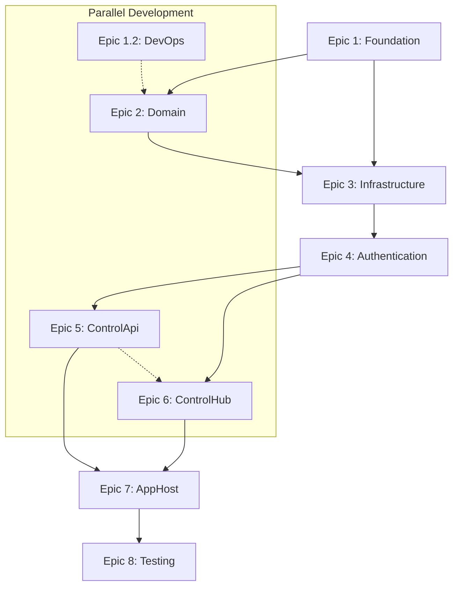

# Task Dependency Matrix

## RideCom Backend Development Dependencies

### Project Structure Dependencies

---

## Detailed Task Dependencies

### Epic 1: Foundation
**No Dependencies** - Starting point

**Enables:**
- All subsequent development
- Domain model implementation
- Infrastructure setup

---

### Epic 2: Domain Model & Business Logic
**Dependencies:**
- Epic 1.1: Project Structure (Required)

**Enables:**
- Infrastructure layer implementation
- Application layer development
- Database schema design

**Parallel Opportunities:**
- Can run parallel with Epic 1.2 (DevOps)

---

### Epic 3: Data Persistence & Infrastructure
**Dependencies:**
- Epic 2.1: Core Domain Entities (Required for EF mappings)
- Epic 1.1: Project Structure (Required)

**Enables:**
- Authentication implementation
- API development
- Caching and external services

**Story-Level Dependencies:**
- **3.1** Database Design → **3.2** Redis Caching → **3.3** External Services

---

### Epic 4: Authentication & Security
**Dependencies:**
- Epic 3.1: Database Design (Required for user storage)
- Epic 3.2: Redis Caching (Required for token management)
- Epic 2.1: Domain Entities (Required for User/Device models)

**Enables:**
- ControlApi implementation
- ControlHub security
- Protected endpoint development

**Story-Level Dependencies:**
- **4.1** JWT Authentication → **4.2** Device Registration

---

### Epic 5: REST API Implementation (ControlApi)
**Dependencies:**
- Epic 4.1: JWT Authentication (Required)
- Epic 4.2: Device Registration (Required)
- Epic 3.3: External Services (Required for TURN credentials)

**Enables:**
- Client authentication
- Device management
- TURN credential distribution

**Parallel Opportunities:**
- Can run parallel with Epic 6 (ControlHub)

---

### Epic 6: Real-time Signaling (ControlHub)
**Dependencies:**
- Epic 4.1: JWT Authentication (Required for SignalR auth)
- Epic 3.2: Redis Caching (Required for backplane)
- Epic 2.2: Domain Services (Required for call management)

**Enables:**
- Real-time communication
- WebRTC signaling
- Presence management

**Story-Level Dependencies:**
- **6.1** SignalR Infrastructure → **6.2** WebRTC Signaling → **6.3** Presence Management

**Parallel Opportunities:**
- Can run parallel with Epic 5 (ControlApi)

---

### Epic 7: Service Orchestration (AppHost)
**Dependencies:**
- Epic 5.1: Core API Endpoints (Required)
- Epic 6.1: SignalR Hub (Required)
- Epic 3.3: External Services (Required for health checks)

**Enables:**
- Service discovery
- Health monitoring
- Production deployment

**Story-Level Dependencies:**
- **7.1** Service Discovery → **7.2** Health Monitoring

---

### Epic 8: Testing & Quality Assurance
**Dependencies:**
- All previous epics (for comprehensive testing)

**Special Considerations:**
- Can begin incrementally as each epic completes
- Unit tests can be written alongside development
- Integration tests require completed services

**Story-Level Dependencies:**
- **8.1** Unit Testing (can start early) → **8.2** Integration Testing (requires services)

---

## Critical Path Analysis

### Primary Critical Path (Longest):
1. Epic 1.1 (Project Structure)
2. Epic 2.1 (Domain Entities) 
3. Epic 3.1 (Database Design)
4. Epic 3.2 (Redis Caching)
5. Epic 4.1 (JWT Authentication)
6. Epic 6.1 (SignalR Infrastructure)
7. Epic 6.2 (WebRTC Signaling)
8. Epic 7.1 (Service Discovery)
9. Epic 8.2 (Integration Testing)

**Estimated Duration: 8-10 Sprints**

### Secondary Path (API):
1. Epic 1.1 → Epic 2.1 → Epic 3.1 → Epic 4.1 → Epic 5.1 → Epic 7.1 → Epic 8.2

**Estimated Duration: 7-8 Sprints**

---

## Risk Mitigation Strategies

### High-Risk Dependencies:
1. **SignalR Authentication** (Epic 6.1 depends on Epic 4.1)
   - Mitigation: Implement basic auth first, enhance later
   
2. **Redis Backplane** (Epic 6.1 depends on Epic 3.2)
   - Mitigation: Start with in-memory, migrate to Redis
   
3. **External TURN Services** (Epic 5.2 depends on Epic 3.3)
   - Mitigation: Mock TURN services for development

### Dependency Bottlenecks:
1. **Epic 4.1 (JWT Authentication)** - Blocks both APIs and SignalR
   - Mitigation: Prioritize and allocate senior developer
   
2. **Epic 3.1 (Database Design)** - Blocks all data operations
   - Mitigation: Complete schema design early, allow parallel EF configuration

---

## Development Team Assignment Recommendations

### Team A (Backend Core):
- Epic 1: Foundation
- Epic 2: Domain Logic  
- Epic 3: Infrastructure
- Epic 4: Authentication

### Team B (Services):
- Epic 5: ControlApi (after Epic 4 ready)
- Epic 6: ControlHub (after Epic 4 ready)

### Team C (DevOps/Quality):
- Epic 1.2: DevOps (parallel with Team A)
- Epic 7: Orchestration (after services ready)
- Epic 8: Testing (continuous)

### Cross-Team Coordination Points:
1. **Sprint 4 End**: Domain and Infrastructure handoff to Services teams
2. **Sprint 6 End**: Authentication ready for both API teams
3. **Sprint 8 End**: Services ready for Orchestration
4. **Sprint 10 End**: Full integration testing